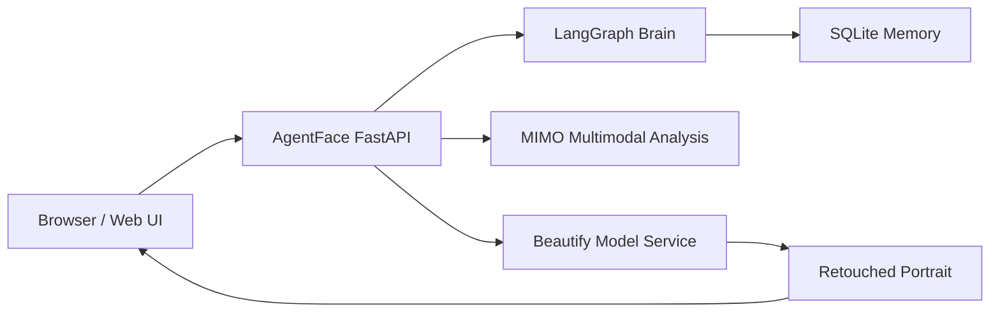

# AgentFace

<div align="center">
  <p><strong>A portrait beauty agent that turns analysis, controllable retouching, and preference learning into one continuous workflow.</strong></p>
  <p>
    
    
    
    
    
  </p>
</div>

## Demo

<!-- DEMO_VIDEO_SLOT_START -->
<div align="center">
  <p>
    <a href="https://hotgirlllllllll.github.io/AgentFace/">
      
    </a>
  </p>
  <p>
    <a href="https://hotgirlllllllll.github.io/AgentFace/">
      
    </a>
  </p>
  <p>README 里点击动图或按钮，就能直接进入在线演示版工作台。</p>
</div>
<!-- DEMO_VIDEO_SLOT_END -->

## Overview

AgentFace 把一次普通的美颜请求拆成一个可解释、可调整、可学习的完整工作流：

- 前端工作台负责上传、调参、结果对比与反馈提交
- LangGraph 负责流程状态、节点编排与长期记忆
- 多模态模型负责面部、肤况、光线与风格建议分析
- 美颜模型负责最终图像生成
- 用户反馈会回写到偏好系统，影响下一轮默认方案

> Web 工作台入口：`/app`  
> API 文档入口：`/docs`  
> 在线演示入口：`https://hotgirlllllllll.github.io/AgentFace/`

## Highlights

| Capability | Description |
| --- | --- |
| Guided workflow | 从上传照片到结果输出，整个流程按步骤推进，而不是一次性黑盒生成。 |
| Human-in-the-loop | 用户可以在分析后手动确认或调整参数，再决定是否生成结果。 |
| Preference memory | 系统会记录评分、历史参数与反馈，逐步形成个体化审美偏好。 |
| Service decoupling | FastAPI、分析模型和美颜模型分层部署，便于本地开发和远程推理。 |

## Architecture



### System roles

| Layer | Responsibility |
| --- | --- |
| `static/` | Web 工作台，负责上传、展示、调参、对比和反馈。 |
| `api/` | 会话接口、用户偏好接口、健康检查接口。 |
| `langgraph_brain/` | 状态机、流程节点、路由和持久化记忆。 |
| `maf_body/` | 模型编排、安全约束、中间件与调用协调。 |
| `models/` | 多模态分析客户端与美颜模型客户端。 |

## Workflow

```text
Upload Photo
  -> Analyze Face / Skin / Lighting
  -> Present Suggested Parameters
  -> Manual Adjustment
  -> Beautify Output
  -> Rating & Feedback
  -> Preference Update
```

更具体地说：

1. 用户上传一张人像照片并输入风格提示
2. 系统调用多模态模型分析肤况、光线、面部特征和风险点
3. 系统给出建议参数，用户可继续微调
4. 用户确认方案后，调用美颜模型生成结果图
5. 用户提交评分与反馈，系统更新历史记录和偏好画像

## Quick Start

### 1. Install

```bash
python -m venv .venv
source .venv/bin/activate
pip install -e ".[dev]"
```

### 2. Configure

```bash
cp .env.example .env
```

至少确认这些配置项已经正确填写：

```env
MIMO_API_KEY=your_api_key
MULTIMODAL_MODEL_URL=http://localhost:your_multimodal_port
BEAUTIFY_MODEL_URL=http://localhost:your_beautify_port
PORT=8000
```

如果你的分析服务或美颜服务部署在远端，也可以通过内网地址或 SSH 隧道接入。

### 3. Run

```bash
uvicorn agent_face.main:app --reload --host 0.0.0.0 --port 8000
```

启动后访问：

- `http://localhost:8000/app` 查看工作台
- `http://localhost:8000/docs` 查看 OpenAPI 文档

## GitHub Demo

如果你希望专家直接从仓库 README 点击进入在线体验，请在仓库设置中开启 GitHub Pages：

1. 打开 `Settings -> Pages`
2. `Build and deployment` 选择 `Deploy from a branch`
3. 分支选择 `main`，目录选择 `/docs`
4. 保存后，演示页会发布到 `https://hotgirlllllllll.github.io/AgentFace/`

## API Snapshot

| Method | Path | Purpose |
| --- | --- | --- |
| `POST` | `/api/v1/sessions` | 创建一轮新的美颜会话 |
| `GET` | `/api/v1/sessions/{id}` | 查询当前会话状态 |
| `POST` | `/api/v1/sessions/{id}/confirm` | 确认方案并提交调整参数 |
| `POST` | `/api/v1/sessions/{id}/feedback` | 提交评分与文本反馈 |
| `GET` | `/api/v1/users/{id}/preferences` | 获取用户偏好画像 |
| `GET` | `/api/v1/users/{id}/history` | 获取历史会话记录 |
| `DELETE` | `/api/v1/users/{id}/preferences` | 重置用户偏好 |
| `GET` | `/api/v1/health` | 健康检查 |

## Project Layout

```text
src/agent_face/
├── api/                 REST API 层
├── bridge/              LangGraph 与 MAF 之间的桥接
├── langgraph_brain/     状态机、节点与长期记忆
├── maf_body/            模型编排、安全与中间件
├── models/              MIMO / 美颜模型客户端
├── shared/              通用工具与观测能力
├── static/              Web 工作台
├── config.py            配置定义
└── main.py              FastAPI 入口
```

## Development Notes

- 当前项目默认使用 SQLite 存储会话与偏好数据
- 前端工作台是静态页面，由 FastAPI 直接托管
- 生产环境可以替换为远程分析服务、远程美颜推理服务和更稳定的数据库后端

## Positioning

AgentFace 不是单纯的“给一张图然后输出一张图”的美颜脚本，而是一个更接近产品工作台的系统原型：

- 有前端工作流
- 有状态管理
- 有用户偏好记忆
- 有可调参数与反馈闭环

如果你准备录制演示视频，建议把它放在最上方的 `Demo` 区块，这样访问仓库的人第一眼就能理解项目完成度和交互质感。
